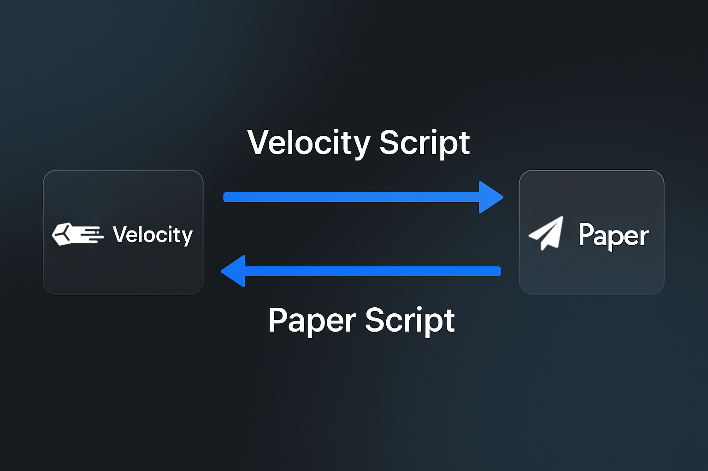

# 📎 Overview

<figure><figcaption></figcaption></figure>

| Context              | Purpose                                             |
| -------------------- | --------------------------------------------------- |
| **Velocity scripts** | Run commands from the proxy onto Paper servers.     |
| **Paper scripts**    | Run commands from a Paper server back to the proxy. |

Scripts are simple YAML files stored under the `CommandBridge/scripts/` folder inside your plugin directory.


Scripts define **custom commands** that your players or console can use!


Each script file can register a command like `/alert` or `/lobby` with specific actions attached.
